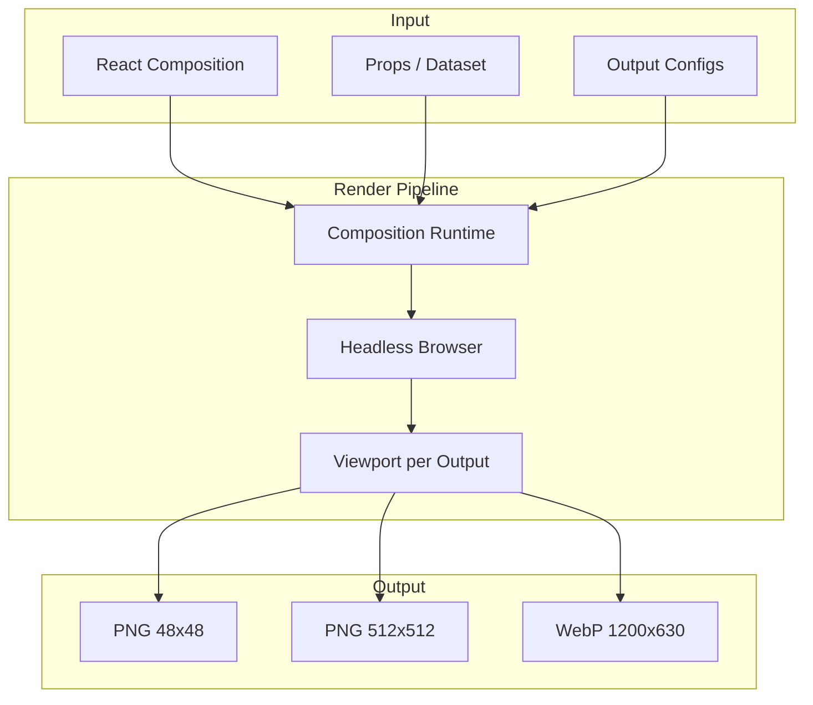
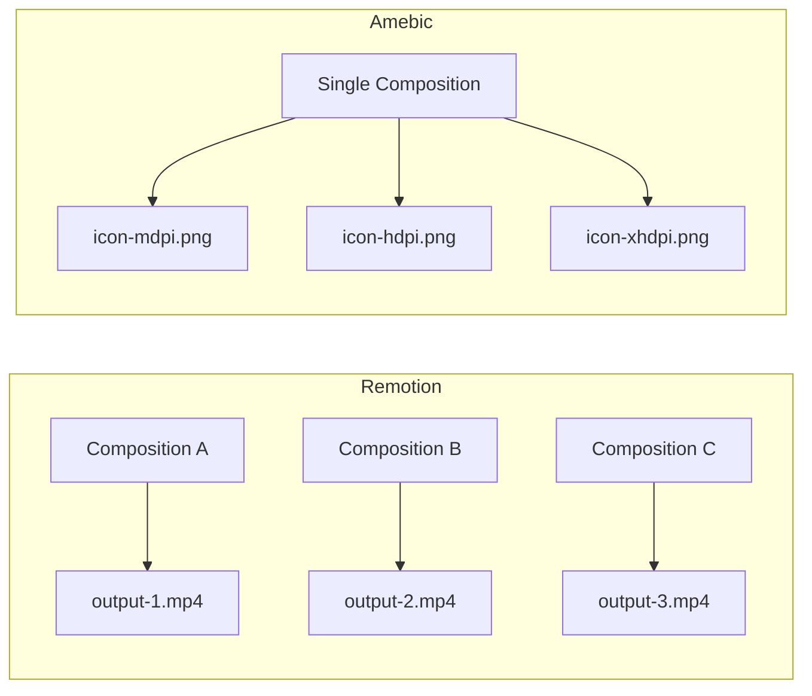
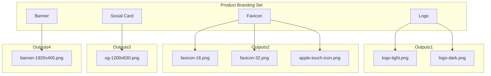
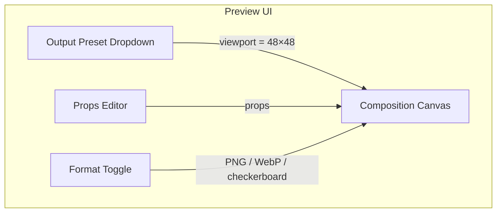
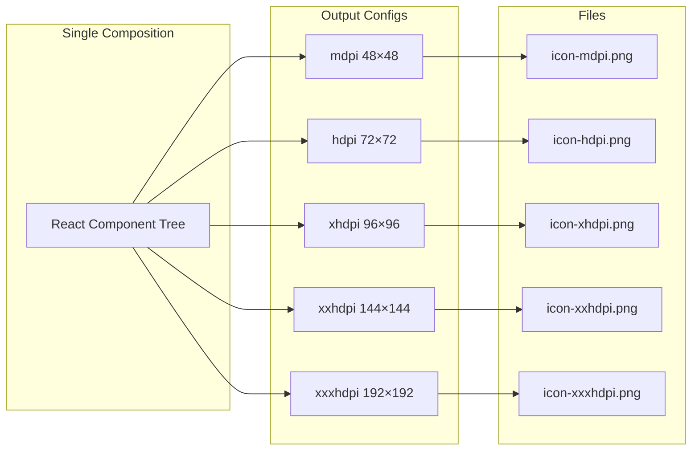
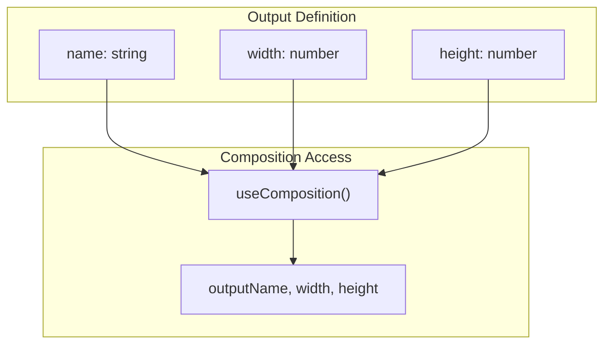
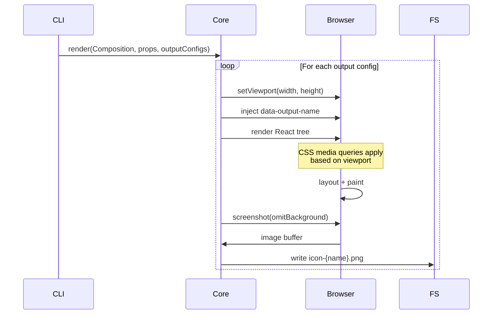

# Amebic — Ideas & Architecture

> **ReMotion for still graphics.** One React composition → many still outputs in different formats, with dynamic generation, preview UI, and static rendering.

---

## System Overview



---

## Vision

Amebic lets you define a single React document/composition and derive from it a variety of still graphics—thumbnails, social cards, banners, print assets—all generated programmatically. Change the composition or its inputs, and all outputs update. Think ReMotion’s composition model, but focused on static frames rather than video.

---

## Core Concepts

### Terminology: What to Call the Source

"Composition" comes from ReMotion and video/audio—it fits their time-based model. For still graphics, alternatives might feel more natural:

| Term          | Pros                                                                                                                            | Cons                                                            |
| ------------- | ------------------------------------------------------------------------------------------------------------------------------- | --------------------------------------------------------------- |
| **Template**  | Clear: reusable structure that gets rendered. Familiar from design tools, document generation.                                  | Might imply "fill in the blanks" more than "define the visual." |
| **Document**  | You used it in the original vision. Fits "one document, many outputs." Design tools use "document" for the top-level container. | Can collide with "document" (DOM).                              |
| **Frame**     | Figma/design-tool language. A frame is what you design.                                                                         | "Frame" suggests animation; we're doing stills.                 |
| **Asset**     | The output is an asset; the source defines it. "Asset template" or "asset definition."                                          | "Asset" often means the _output_ (the PNG), not the source.     |
| **Blueprint** | Emphasizes structure, spec.                                                                                                     | Less common in design/creative contexts.                        |
| **Scene**     | Film/animation. One "scene" = one visual.                                                                                       | Remotion-adjacent; might feel derivative.                       |
| **Plate**     | Print/design: a plate is what gets printed.                                                                                     | Obscure.                                                        |

**Recommendation:** **Template** or **Document** are strong candidates. "Template" is clearest for "one structure, many rendered instances." "Document" matches your original phrasing and design-tool conventions. We'll use **composition** in this doc for now (ReMotion parity) but treat the choice as open.

### Composition Model (ReMotion-inspired)

- **Single source of truth**: One React component tree defines the visual.
- **Input props / dataset**: Compositions accept props (text, images, colors, dimensions) that drive variations.
- **Dimensions as first-class**: Width, height, and aspect ratio are explicit, not inferred from viewport.
- **Still-first**: No timeline or frames—we render a single “frame” at a time, though we may support multiple named “variants” or “states” per composition.

### Key Differences from ReMotion

| ReMotion                    | Amebic                                |
| --------------------------- | ------------------------------------- |
| Time-based (frames, FPS)    | Still-based (single frame per render) |
| Video, GIF, sequence export | PNG, SVG, WebP, JPEG, etc.            |
| `useCurrentFrame()`         | No frame—props and output name only   |
| Animation primitives        | Layout, typography, effects, overlays |

### Remotion vs Amebic: How Outputs Work

**Remotion** treats each composition as **one output**. To get multiple outputs, you typically:

- **Register multiple compositions** in `Root.tsx` — e.g. `<Composition id="Instagram" ... />` and `<Composition id="YouTube" ... />`. Each has its own dimensions. You render them separately (or Remotion Studio lets you pick which to render).
- **Use `--scale`** — Design at 1920×1080, render with `--scale=2` to get 4K. Same aspect ratio, different pixel density. One output per render; run multiple times for multiple scales.
- **Override dimensions** — `--width` and `--height` flags can override composition dimensions at render time. Again: one output per render invocation.
- **Dataset rendering** — Pass an array of props; Remotion renders N videos (or stills) from N items. But each item shares the _same_ dimensions—you're varying _content_, not _output size_.

So Remotion's model: **one composition → one output per render**. Multiple outputs = multiple compositions or multiple CLI runs.

**Amebic** inverts this: **one composition → many outputs in one pass**. You declare an array of output configs (name, width, height, format). A single render loops over them, sets the viewport for each, and produces `icon-mdpi.png`, `icon-hdpi.png`, etc. from the same React tree. CSS media queries and the output name let the composition adapt. Think of it as "Remotion's dataset rendering, but for output dimensions instead of content."



### Sets: Multiple Compositions Grouped

A **Set** groups multiple compositions that belong together—e.g. a branding set for one product: logo, favicon, social card, banner, etc. Each composition in the set can have its own outputs. Render the set → get the full asset pack.



**Use cases:**

- **Product branding**: Logo, favicon, social cards, email header—one set per product.
- **App icon pack**: Icon + splash + store assets—one set per app.
- **Campaign kit**: Hero, thumbnail, share graphic—one set per campaign.

**API sketch:**

- `registerSet(id, { compositions: [...] })` — register a set
- `amebic render ./sets/ProductBranding.ts` — render all compositions in the set
- Preview UI: set selector in sidebar → pick composition → pick output

---

## Feature Set

### 1. Dynamic Generation from Data

- **Dataset-driven**: Pass a JSON array (or similar) and generate one graphic per item—e.g. social cards for each blog post, thumbnails for each product.
- **Props / input schema**: Compositions declare their input shape; the system validates and passes it through.
- **Templates**: Reusable composition templates with slots for text, images, logos.

### 2. Output Formats

- **PNG** — lossless, transparency support
- **WebP** — smaller files, transparency
- **JPEG** — no transparency, good for photos/backgrounds
- **SVG** — vector when possible (see “Rendering strategies” below)

### 3. Transparency & Alpha

- **Transparent backgrounds** as default for PNG/WebP.
- **Alpha channel** preserved through the full pipeline.
- **Background override** option for compositions that need a solid color (e.g. for social platforms that don’t support transparency).

### 4. Graphical Effects

Support effects that can be expressed via:

- **CSS**: `filter`, `blend-mode`, `backdrop-filter`, gradients, shadows, etc.
- **WebGL / Canvas**: Custom shaders, complex gradients, procedural textures when CSS isn’t enough.
- **Layering**: Multiple layers with blend modes, masks, clipping.

**Considerations:**

- CSS-based effects work well with DOM-based rendering (Puppeteer/Playwright).
- WebGL/Canvas may require a hybrid approach: render to canvas, then capture.
- SVG export is ideal for vector content but may not capture all CSS/WebGL effects—fallback to raster for those cases.

### 5. Preview Web UI

- **Set / composition navigator**: Sidebar to pick a set, then a composition within it.
- **Live preview**: See the composition as you edit, with hot reload.
- **Dimension controls**: Resize viewport, test different aspect ratios.
- **Output preset switcher**: Jump between named outputs (mdpi, hdpi, favicon, etc.) to preview media-query behavior.
- **Input editor**: Edit props/input data in a form or JSON editor.
- **Format preview**: Toggle between PNG/WebP/JPEG preview, show transparency (checkerboard).
- **Batch preview**: For dataset-driven compositions, browse through generated variants.



### 6. Static Rendering

- **CLI**: `amebic render ./Composition.tsx --out-dir ./output --format png`
- **CLI (set)**: `amebic render ./sets/ProductBranding.ts` — render all compositions in a set
- **Programmatic API**: `renderComposition(Composition, props, { width, height, format })`
- **Batch mode**: Render many compositions from a dataset in one run.
- **Set mode**: Render a full set → all compositions, all outputs, organized by composition.
- **Headless**: Runs in Node (Puppeteer/Playwright) or similar—no browser window.

### 7. Multiple Outputs & Responsive Rendering

**One React DOM structure → many image outputs at different dimensions.** Think Android/iOS icon packages: the same icon composition yields `mdpi`, `hdpi`, `xhdpi`, `xxhdpi`, `xxxhdpi` (Android) or `1x`, `2x`, `3x` (iOS)—same content, different pixel dimensions.



#### CSS Media Queries Drive Layout

The viewport is set to the **exact output dimensions** for each render. CSS media queries then apply naturally:

- Rendering at 48×48 → viewport is 48×48 → `@media (max-width: 64px)` matches
- Rendering at 192×192 → viewport is 192×192 → `@media (min-width: 128px)` matches

**Example:** Thicker strokes at small dimensions, simplified details when tiny:

```css
/* Thicker stroke for legibility at small dimensions */
@media (max-width: 64px) {
  .icon-path {
    stroke-width: 2px;
  }
}
@media (min-width: 128px) {
  .icon-path {
    stroke-width: 1px;
  }
}
```

#### Nameable Outputs

Outputs are **named**, not just dimensional. Names enable:

- **Semantic file paths**: `icon-mdpi.png`, `icon-hdpi.png`, `favicon-32.png`, `apple-touch-icon.png`
- **Output-specific overrides**: When the same dimensions might need different treatment (e.g. `favicon` vs `android-chrome` at 192×192)
- **Platform presets**: Android density buckets, iOS scale factors, social OG sizes



The composition can branch on **both** viewport dimensions (via media queries) **and** `outputName` (via `useComposition()` or a data attribute) when you need discrete, name-based differences:

```tsx
// Same 48×48 output, but "favicon" gets a simplified variant
const { outputName } = useComposition();
return outputName === "favicon" ? <SimplifiedIcon /> : <FullIcon />;
```

#### Output Configuration Schema (Draft)

```ts
type OutputConfig = {
  name: string; // e.g. "mdpi", "1x", "favicon", "og"
  width: number;
  height: number;
  format?: "png" | "webp" | "jpeg" | "svg";
};

// Android icon preset
const androidOutputs: OutputConfig[] = [
  { name: "mdpi", width: 48, height: 48 },
  { name: "hdpi", width: 72, height: 72 },
  { name: "xhdpi", width: 96, height: 96 },
  { name: "xxhdpi", width: 144, height: 144 },
  { name: "xxxhdpi", width: 192, height: 192 },
];

// iOS + web favicon preset
const faviconOutputs: OutputConfig[] = [
  { name: "favicon-16", width: 16, height: 16 },
  { name: "favicon-32", width: 32, height: 32 },
  { name: "apple-touch-icon", width: 180, height: 180 },
];
```

---

## Technical Architecture

### Rendering Strategies

| Strategy                                    | Pros                                     | Cons                          |
| ------------------------------------------- | ---------------------------------------- | ----------------------------- |
| **Headless browser (Puppeteer/Playwright)** | Full DOM + CSS + fonts, accurate WYSIWYG | Heavier, slower, needs Chrome |
| **html-to-image / dom-to-image**            | Client-side, no headless                 | Limited CSS support, no WebGL |
| **Server-side React → HTML → screenshot**   | Same as headless, flexible               | Same weight                   |
| **Canvas/SVG direct**                       | Fast, lightweight                        | Manual layout, no CSS         |

**Recommendation:** Start with **Puppeteer or Playwright** for maximum fidelity (CSS, fonts, transparency, complex layouts). Add **html-to-image** or similar as an optional client-side path for quick previews or lightweight use cases. WebGL/Canvas effects can be rendered in an iframe or dedicated canvas, then composed.

### Stack Sketch

- **React** — composition authoring
- **Vite** — dev server, HMR for preview UI
- **Puppeteer or Playwright** — headless rendering
- **TypeScript** — throughout
- **Bun** — package manager, scripts, possibly runtime

### Project Structure (Draft)

```
amebic/
├── packages/
│   ├── core/           # Composition runtime, render API, set registry
│   ├── preview/        # Preview web UI (Vite + React)
│   ├── cli/            # CLI for render, init, etc.
│   └── templates/      # Example compositions + sets
├── docs/
└── .ai/
```

### Multi-Output Render Pipeline



---

## Composition API (Draft)

```tsx
import { Composition, useComposition } from "amebic";

type Props = {
  title: string;
  subtitle?: string;
  backgroundColor?: string;
};

export const SocialCard: React.FC<Props> = (props) => {
  const { width, height } = useComposition(); // from context

  return (
    <Composition width={1200} height={630}>
      <div
        style={{
          width: "100%",
          height: "100%",
          background: props.backgroundColor ?? "transparent",
          display: "flex",
          flexDirection: "column",
          justifyContent: "center",
          padding: 48,
        }}
      >
        <h1>{props.title}</h1>
        {props.subtitle && <p>{props.subtitle}</p>}
      </div>
    </Composition>
  );
};

// Register for preview + render
registerComposition(SocialCard, {
  defaultProps: { title: "Hello", subtitle: "World" },
  defaultDimensions: { width: 1200, height: 630 },
});
```

#### Multi-Output Icon Example

```tsx
import { Composition, useComposition } from "amebic";
import "./AppIcon.css"; // contains media queries for stroke-width, etc.

export const AppIcon: React.FC = () => {
  const { width, height, outputName } = useComposition();

  // Optional: discrete overrides by output name (e.g. favicon gets simplified)
  const simplified = outputName === "favicon-16" || outputName === "favicon-32";

  return (
    <Composition width={width} height={height}>
      <svg viewBox="0 0 24 24" className="app-icon">
        {simplified ? (
          <path d="M12 2L2 7v10l10 5 10-5V7L12 2z" />
        ) : (
          <path d="..." className="icon-path" />
        )}
      </svg>
    </Composition>
  );
};

registerComposition(AppIcon, {
  outputs: [
    { name: "favicon-16", width: 16, height: 16 },
    { name: "favicon-32", width: 32, height: 32 },
    { name: "mdpi", width: 48, height: 48 },
    { name: "hdpi", width: 72, height: 72 },
    { name: "xhdpi", width: 96, height: 96 },
    { name: "xxhdpi", width: 144, height: 144 },
    { name: "xxxhdpi", width: 192, height: 192 },
    { name: "apple-touch-icon", width: 180, height: 180 },
  ],
});
```

---

## Open Questions & Considerations

1. **SVG export**: When composition is pure vector (e.g. icons, simple shapes), can we emit true SVG? Or do we always rasterize? Hybrid: attempt SVG when possible, fallback to PNG.
2. **Fonts**: How do we ensure fonts load in headless? Local fonts, `@font-face`, or bundled webfonts. Need a clear font-loading story.
3. **Images**: Handling `` and external URLs—CORS, caching, local paths. May need a `staticFile()`-style helper like ReMotion.
4. **WebGL integration**: If we want shaders/procedural effects, do we use a library (e.g. react-three-fiber, PixiJS) or a minimal custom canvas layer?
5. **Concurrency**: Batch rendering many images—parallelize browser instances or pages?
6. **Caching**: Cache rendered outputs when inputs haven’t changed? Content-addressable keys.
7. **Naming**: “Amebic” — flexible, adaptable, organic. Fits the “one composition, many forms” idea.
8. **Container queries**: Future option for size-aware layout? `@container` could be more explicit than media queries when the composition is the “container.”

9. **Composition vs Template vs Document**: Final terminology choice (see "Terminology" above).

---

## Next Steps

- [ ] Spike: minimal React composition + Puppeteer render to PNG with transparency
- [ ] Define `Composition` and `useComposition` API (including `outputName`)
- [ ] Implement multi-output render: viewport per output, inject `data-output-name`
- [ ] Scaffold preview UI (Vite + React) with output preset switcher
- [ ] Define Set API: `registerSet()`, set file format, render-set CLI
- [ ] Add dataset-driven batch render
- [ ] Document font and image handling
- [ ] Explore WebGL/Canvas effect integration
