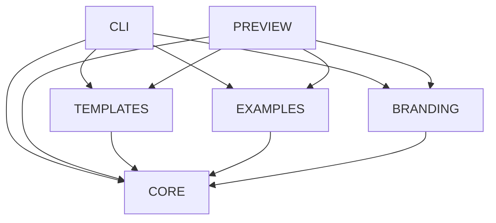
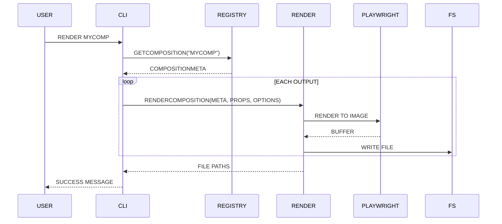

# AGENTS.MD

THIS FILE PROVIDES GUIDANCE TO AI CODING AGENTS WORKING ON THE AMEBIC CODEBASE.

## PROJECT OVERVIEW

AMEBIC IS A TOOLKIT FOR GENERATING STILL GRAPHICS USING REACT. USERS DEFINE GRAPHICS AS REACT COMPONENTS AND RENDER THEM TO MULTIPLE IMAGE FORMATS AND SIZES.

TAGLINE: "REACT COMPOSITIONS FOR STILL GRAPHICS. ONE COMPONENT, MANY OUTPUTS."

## ARCHITECTURE

```
/packages
├── core/                 # CORE API, REGISTRY, RENDER ENGINE
│   ├── src/
│   │   ├── index.ts          # PUBLIC API EXPORTS
│   │   ├── types.ts          # TYPESCRIPT DEFINITIONS
│   │   ├── registry.ts       # COMPOSITION REGISTRY
│   │   ├── render.ts         # HEADLESS RENDER ENGINE (PLAYWRIGHT)
│   │   └── context.ts        # REACT CONTEXT FOR COMPOSITIONS
│   └── package.json
├── cli/                  # COMMAND LINE INTERFACE
│   ├── src/
│   │   └── cli.ts            # CLI ENTRY POINT
│   └── package.json
├── preview/              # VITE + REACT PREVIEW UI
│   ├── src/
│   │   └── ...               # PREVIEW COMPONENTS
│   └── package.json
├── templates/            # PUBLISHED COMPOSITIONS
│   ├── src/
│   │   └── compositions/     # SOCIALCARD, APPICON, ETC.
│   └── package.json
├── examples/             # EXPERIMENTAL COMPOSITIONS
│   └── src/
├── branding/             # LOGO & BANNER ASSETS
│   └── src/
/apps
└── docs/                 # NEXTRA DOCUMENTATION SITE
/skills
├── amebic-render/        # AI SKILL FOR RENDERING
└── amebic-composition/   # AI SKILL FOR COMPOSITIONS
```

## PACKAGE DEPENDENCY GRAPH



## KEY CONCEPTS

### COMPOSITION

A REACT COMPONENT THAT RENDERS A STILL GRAPHIC. USES `USECOMPOSITION()` FOR VIEWPORT METADATA.

### OUTPUT

A NAMED DIMENSION CONFIG (E.G., "OG" = 1200×630). ONE COMPOSITION CAN HAVE MANY OUTPUTS.

### REGISTRY

COMPOSITIONS ARE REGISTERED AT IMPORT TIME USING `REGISTERCOMPOSITION()`.

### RENDER

HEADLESS BROWSER (PLAYWRIGHT) RENDERS REACT COMPONENTS TO PNG/WEBP/JPEG.

## WORKFLOW

### ADDING A NEW COMPOSITION

1. CREATE COMPONENT IN `PACKAGES/TEMPLATES/SRC/COMPOSITIONS/`
2. USE `USECOMPOSITION()` HOOK FOR DIMENSIONS
3. CALL `REGISTERCOMPOSITION()` WITH OUTPUT CONFIGS
4. EXPORT FROM `PACKAGES/TEMPLATES/SRC/COMPOSITIONS/INDEX.TS`
5. TEST WITH `BUN RUN DEV` (PREVIEW UI)
6. RENDER WITH `BUN RUN RENDER <NAME> --OUT-DIR ./OUTPUT`

### RENDER PIPELINE



## COMMANDS

| COMMAND | DESCRIPTION |
|---------|-------------|
| `BUN INSTALL` | INSTALL ALL DEPENDENCIES |
| `BUN RUN BUILD` | BUILD ALL PACKAGES |
| `BUN RUN DEV` | START PREVIEW UI (LOCALHOST:5174) |
| `BUN RUN TEST` | RUN VITEST ACROSS PACKAGES |
| `BUN RUN LIST` | LIST ALL COMPOSITIONS |
| `BUN RUN RENDER <ID>` | RENDER A COMPOSITION |
| `BUN RUN RENDER <ID> --SET` | RENDER A SET |

## CODING STANDARDS

### COMPOSITION PATTERNS

- **INLINE STYLES ONLY** - NO EXTERNAL CSS IN HEADLESS RENDER
- **SET DISPLAYNAME** - REQUIRED FOR READABLE COMPOSITION IDS
- **USE TYPESCRIPT** - STRICT TYPES ON ALL PROPS
- **DEFAULT PROPS** - ALWAYS PROVIDE SENSIBLE DEFAULTS

### EXPORT PATTERNS

CORE PACKAGE USES EXPLICIT RE-EXPORTS:

```TS
// GOOD - EXPLICIT
EXPORT { REGISTERCOMPOSITION } FROM "./REGISTRY.JS";
EXPORT TYPE { COMPOSITIONCONFIG } FROM "./TYPES.JS";

// BAD - WILDCARD
EXPORT * FROM "./REGISTRY.JS";
```

### TESTING

- UNIT TESTS: `PACKAGES/CORE/SRC/__TESTS__/*.TEST.TS`
- INTEGRATION TESTS: RENDER PIPELINE WITH PLAYWRIGHT
- RUN: `BUN RUN TEST`

## TECH STACK

- **RUNTIME**: NODE.JS 18+
- **LANGUAGE**: TYPESCRIPT 5.7+
- **PACKAGE MANAGER**: BUN
- **BUILD**: TSC + VITE (PREVIEW)
- **TESTING**: VITEST
- **RENDERING**: PLAYWRIGHT
- **UI**: REACT 18 + TAILWIND (PREVIEW)
- **DOCS**: NEXTRA 2

## COMMIT STYLE

THIS PROJECT USES CONVENTIONAL COMMITS. SEE CONTRIBUTING.MD FOR FULL DETAILS.

QUICK REFERENCE:
- `FEAT:` - NEW FEATURES
- `FIX:` - BUG FIXES
- `DOCS:` - DOCUMENTATION
- `REFACTOR:` - CODE REFACTORING
- `TEST:` - TEST CHANGES
- `CHORE:` - TOOLING/DEPS

ALWAYS USE PRESENT TENSE AND LOWERCASE AFTER THE COLON.

## AI SKILLS

SKILL LIVES IN `/SKILLS/AMEBIC/` AND IS INSTALLABLE VIA `NPX SKILLS ADD OWNER/AMEBIC --SKILL AMEBIC`.

THE SKILL CONTAINS:
- **SKILL.MD** - OVERVIEW AND QUICK START
- **COMPOSITION.MD** - CREATING COMPOSITIONS, DESIGN PATTERNS
- **RENDER.MD** - CLI AND PROGRAMMATIC RENDERING

## COMMON ISSUES

### CHROMIUM NOT FOUND

```BASH
BUNX PLAYWRIGHT INSTALL CHROMIUM
```

### COMPOSITION NOT REGISTERED

ENSURE COMPOSITION IS IMPORTED IN `PACKAGES/TEMPLATES/SRC/COMPOSITIONS/INDEX.TS`.

### TYPE ERRORS ACROSS PACKAGES

RUN `BUN RUN BUILD` TO ENSURE ALL `.D.TS` FILES ARE GENERATED.
