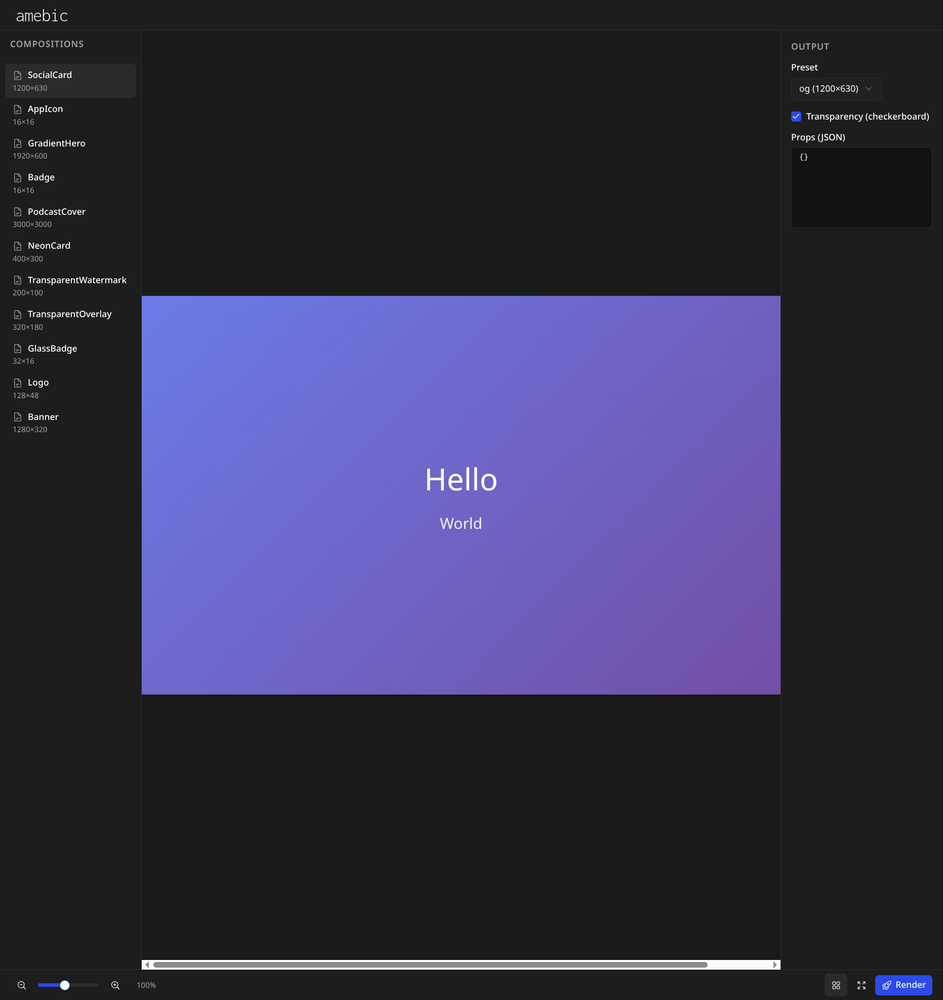

# Amebic


**React compositions for still graphics.** One component, many outputs.

[](https://opensource.org/licenses/MIT)




_The Amebic preview UI - edit compositions in real-time_

## Quick Start

```bash
bun install
bun run build
```

Create a project entry file such as `src/index.ts` or `src/index.tsx` that imports the compositions you want to register. The CLI loads that file from the current working directory.

### Preview UI

```bash
bun run dev
```

Opens the preview at http://localhost:5174. Pick a composition, switch outputs, edit props.

### Render to Images

```bash
# List registered compositions
bun run list

# Render a composition (all outputs)
bun run render AppIcon --out-dir ./output

# Render a set (all compositions in the set)
bun run render ProductBranding --set --out-dir ./output

# With custom props
bun run render SocialCard --out-dir ./output --props ./props.json
```

If your entry file lives somewhere else, pass it explicitly:

```bash
bun run render SocialCard --entry ./graphics/entry.ts --out-dir ./output
```

**First-time setup:** Install Chromium for Playwright:

```bash
bunx playwright install chromium
```

## Packages

| Package             | Description                                        |
| ------------------- | -------------------------------------------------- |
| `@amebic/core`      | Composition API, registry, render (Node)           |
| `@amebic/preview`   | Vite + React preview UI                            |
| `@amebic/cli`       | CLI for `render` and `list`                        |
| `@amebic/templates` | Published compositions (SocialCard, AppIcon, etc.) |
| `@amebic/examples`  | Experimental compositions (transparency, overlays) |
| `@amebic/branding`  | Logo and banner assets (Inconsolata Light 300)     |

## Testing

```bash
bun run test
```

Runs Vitest for core, templates, and examples (unit + integration).

## Creating a Composition

```tsx
import { useComposition, registerComposition } from "@amebic/core";

export const MyGraphic: React.FC<{ title: string }> = (props) => {
  const { width, height, outputName } = useComposition();
  return <div style={{ width, height, background: "#333", color: "#fff" }}>{props.title}</div>;
};

registerComposition(MyGraphic, {
  defaultProps: { title: "Hello" },
  outputs: [
    { name: "og", width: 1200, height: 630 },
    { name: "thumb", width: 400, height: 400 },
  ],
});
```

Import your composition from your project entry file so the CLI can register it at runtime.

---

_Amebic is inspired by the composition model of [ReMotion](https://www.remotion.dev/)._
